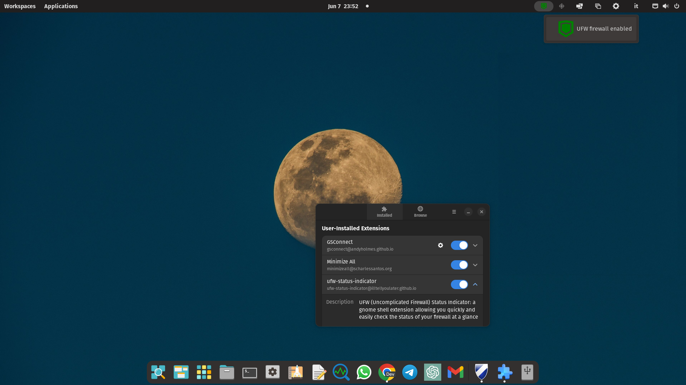
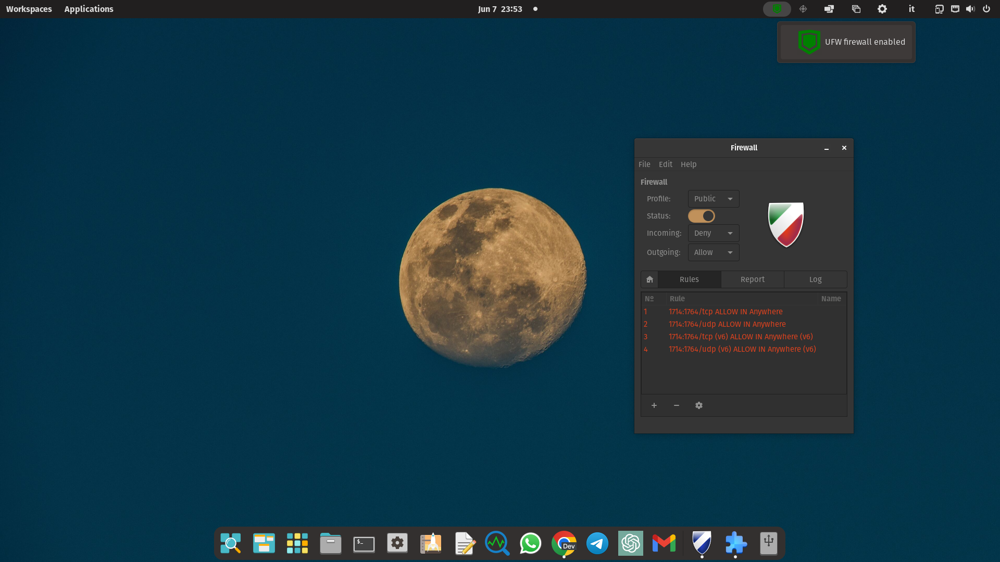
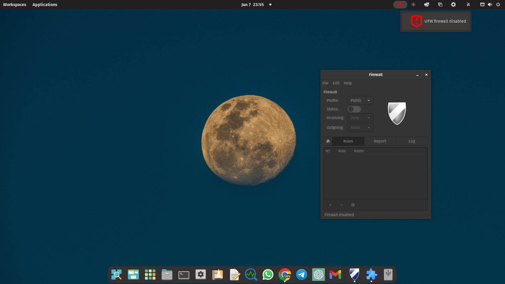

# UFW Status Indicator: a visual indicator for the Uncomplicated Firewall (ufw)

**UFW Status Indicator** is a Gnome Shell extension that provides a nice and reliable visual indicator for the Uncomplicated Firewall (ufw) status.

It looks like this 







and it nicely complements [Gufw](https://github.com/costales/gufw), a beautiful and functional ufw GUI by [@costales](https://github.com/costales/) which is also shown in the above screenshots, and which I highly recommend trying out for a seamless and user-friendly firewall management experience.

## How the extension works

To enable the extension to function properly, a root cron job is required. This cron job runs the command `ufw status` once every minute and copies the output to `/var/log/ufw-indicator.ext.log`. This file is monitored by the extension, and as soon an update is detected it will read the file and change the UFW indicator icon accordingly. 

The log file monitoring is operated by leveraging watchdog capabilities of the GTK Gio library (rather than looping over the file and checking for changes) and this approach contributes to efficient operation of the extension resulting in an almost nonexistant system resources utilizazion.

If the file `/var/log/ufw-indicator.ext.log` is not found by the extension or contains unexpected content, the indicator will turn to orange and clicking on it will provide additional information on the encountered problem.

## Installation

To install the UFW Status Indicator, you need to add a root cron job and then install the extension like you normally would for any Gnome Shell Entension. Here are the steps:

1. Open a terminal and type the following command to edit the root crontab file:

    ```
    sudo crontab -e
    ```

2. Add the following line to the crontab file:

    ```
    * * * * * LC_ALL=C LANGUAGE=C LANG=C ufw status | grep "Status:" > /var/log/ufw-status-indicator.ext.log
    ```

3. Save and close the file; from now on the extension can be easily installed for any user.

4. Download the extension zip file from the releases section.

5. Extract the zip file to `~/.local/share/gnome-shell/extensions/`, making sure to include the folder containing the extension files (`ufw-status-indicator@illtellyoulater.github.io`) without changing its name:

    ```
    unzip ufw-status-indicator.zip -d ~/.local/share/gnome-shell/extensions/
    ```

6. Enable the extension using your usual extension manager.

After these steps, the UFW Status Indicator should show up with a green shield icon. 

## Notes

I greatly appreciate your interest in this extension and would be delighted to hear your feedback.

If there is sufficient interest, I can certainly explore the possibility of rewriting the code in a manner that is firewall agnostic, enabling it to function with any firewall solution.

If you are interested in seeing this and other features come to life, and you would like to support their development, please consider [buying me a coffee](https://www.buymeacoffee.com/notreallydata). Your generous contribution makes a significant difference and serves as a great motivator. 
Thank you kindly for your support!

